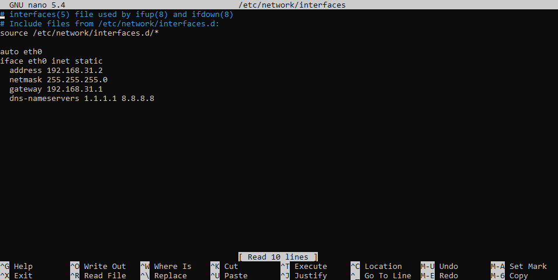
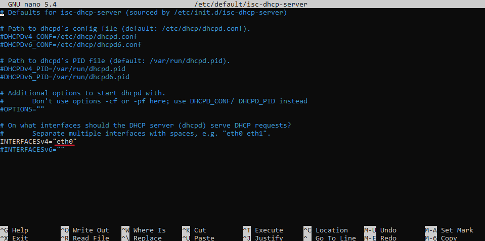

# Praktický návod na DHCP server na distribuci Linuxu Debian 11
## Co budu potřebovat?
Pro instalaci a nastavení DHCP serveru budu potřebovat jen:
- Zařízení s Debian 11
Pro praktickou část budu potřebovat:
- Router
Volitelné:
- Počítač (pro připojení na zařízení přes SSH)

## Realizace
### 1. Připojení
Pokud využíváme volitelný počítač, tak ho připojíme přes SSH k našemu budoucímu DHCP serveru.
Náš počítač a naše zařízení připojíme k routeru (doporučujeme zařízení s Debianem připojovat přes kabel)
### 2. Zjištění informací o podsíti
Zjistíme z našeho počítače, popřípadě z routeru následující informace:
- IP adresu sítě
- Masku sítě
- IP adresu routeru
- Broadcast adresu
Dále vypneme DHCP server.

### 3. Nastavení statické IP adresy
Nastavení statické IP adresy můžeme najít v souboru */etc/network/interfaces*
Pokud se bojíte, že pokazíte nastavení, zálohujte si soubor přikazem:
```
$ cp /etc/network/interfaces ~
```
Otevřeme úpravu souboru příkazem:
```
$ sudo nano /etc/network/interfaces
```
Zde přidáme naše informace v tomto formátování:



### 4. Instalace a konfigurace DHCP serveru
Nejdřív zaktualizujeme balíčky na našem zařízení s distribucí Debian.
```
$ sudo apt update
```


Dále nainstalujeme balíček pro DHCP server.

```
$ sudo apt install isc-dhcp-server
```

Provedeme konfiguraci DHCP která se nachází v souboru */etc/dhcp/dhcpd.conf*.
```
$ sudo nano /etc/dhcp/dhcpd.conf
```
V tomto souboru odkomentujeme tyto řádky:
```
subnet 10.5.5.0 netmask 255.255.255.224 {
  range 10.5.5.26 10.5.5.30;
  option domain-name-servers ns1.internal.example.org;
  option domain-name "internal.example.org";
  option routers 10.5.5.1;
  option broadcast-address 10.5.5.31;
  default-lease-time 600;
  max-lease-time 7200;
}
```
a doplníme naše informace, které jsme získávali v bodě 2. Vyberte si vlastní rozsah adres pro DHCP. Můžeme také přidat DNS server nebo dobu pronájmu.


Uložíme klávesovou zkratkou 'Ctrl+X'

Dále vybereme rozhraní, přes kterému se budeme připojovat na náš server, to uděláme v souboru */etc/default/isc-dhcp-server*. Pokud ho neznáte, tak ho zjistěte příkazem 'ip a'.
```
$ sudo nano /etc/default/isc-dhcp-server
```
Vyplňte uvozovky na předposledním řádku vaším názvem rozhraní.

Pokud chcete DHCP využívat i v IPv6, tak uvozovky na dalším řádku také vyplňte. V našem případě ji nebudeme využívat, takže řádek zakomentujeme.

Uložíme klávesovou zkratkou 'Ctrl+X'



Nyní restartujeme síťový ovladač a DHCP server příkazy:
```
$ sudo systemctl restart networking
$ sudo systemctl restart isc-dhcp-server
```
A ověříme správnou funkcionalitu DHCP serveru příkazem:
```
$ sudo systemctl status isc-dhcp-server
```


